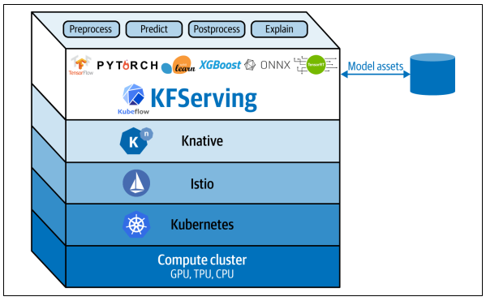

## KFServing

* KFServing is extending serverless application development to model serving.

### Data Plane


* KFServing defines the data plane, which links all of the standard model serving components together and uses Knative 
  to provide serverless abstractions for the service plane.
* Endpoint - KFServing instances are divided into two endpoints: default and canary. The
  endpoints allow users to safely make changes using the pinned and canary roll‐
  out strategies.
* Component - Each endpoint has multiple components: `predictor` (required), `explainer`, and `transformer`.
  * Predictor - the workhorse of the KFServing instance. It is simply a model and a 
    model server that is made available at a network endpoint.
  * Explainer - enables an optional alternative data plane that provides model
    explanations in addition to predictions.
  * Transformer - enables users to define a pre- and postprocessing step before the
    prediction and explanation workflows. Like the explainer, it is configured with
    relevant environment variables.


### InferenceService

* Serverless inference resource that describes static graph, by providing a Kubernetes CRD for serving ML models on arbi‐
  trary frameworks.

```
apiVersion: "serving.kubeflow.org/v1alpha2"
kind: "InferenceService"
metadata:
  name: "flowers-sample"
spec:
  default:
    predictor:
      tensorflow:
        storageUri: "gs://kfserving-samples/models/tensorflow/flowers"
```

* Above will give you a serving instance—with an HTTP endpoint—that will serve a model using a requested framework server type.
* @see `inferenceservice.yml`

### Sending the request

* Sending a prediction request to KFServing InferenceService
```
kubectl port-forward --namespace istio-system \
    $(kubectl get pod --namespace istio-system \
    --selector="app=istio-ingressgateway" \
    --output jsonpath='{.items[0].metadata.name}') \
    8080:80
    
curl -v -H "Host: recommender.my-namespace.example.com" \
    http://localhost:8080/v1/models/recommender:predict -d \
    '{"signature_name":"serving_default",
    "inputs": {"products": [[1],[2]],"users" : [[25], [3]]}}'
```

## Infrastructure



* Compute cluster - Hardware that runs your compute cluster is the base-building block for all the layers above
* K8s - critical layer, right above the compute cluster, that manages, orchestrates, and deploys a variety of resources—successfully abstracting the underlying
  hardware. The main resources we will focus on are deployments, horizontal pod autoscalers (HPA), and ingresses.
* Istio - All network traffic ( HTTP, REST, gRPC, etc.) from an individual service instance flows via its local sidecar proxy
  to the appropriate destination. Thus, the service instance is not aware of the network
  at large and only knows about its local proxy.
* Knative - takes advantage of the abstractions that Istio provides. Knative Serving builds on Kubernetes and Istio 
  to support deploying and serving serverless applications. By building atop Kubernetes resources like deployments and HPAs, and Istio resources, 
  like virtual services.
  

## Debugging

* https://kserve.github.io/website/developer/debug/

## Resources

* `https://www.youtube.com/watch?v=VtZ9LWyJPdc&t` - Hands-on Serving Models Using KFserving

