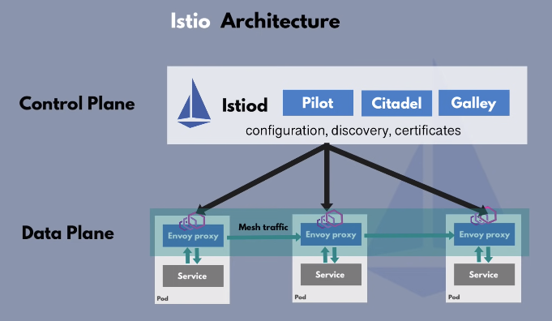
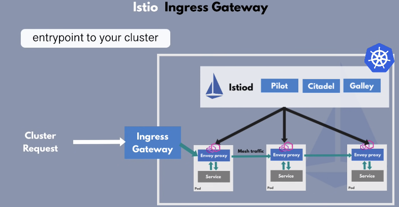

## Istio

* Traditionally, Kubernetes has used an Ingress controller to handle the traffic that enters the cluster from the outside.
  When using Istio, this is no longer the case. Istio has replaced the familiar Ingress resource with new Gateway and VirtualServices resources.
  They work in tandem to route the traffic into the mesh. Inside the mesh there is no need for Gateways since the services can access each other
  by a cluster local service name.
* Istiod - controller
* Sidecar containers are Envoy Proxies
* Istio is an implementation of Service Mesh pattern
* Istio is configurable via YAML files (due to use of CRD (CustomResourceDefinitions of K8s))
* Flow: 
  * Creation of CRDs (`VirtualServices`, `DestinationRule`) 
  * Istiod converts high level routing rules into Envoy specific configurations
  * Configuration is propagated into Proxy sidecars
* Pilot 
  * Internal Registry for Services & their endpoints
  * discovers automatically services to send traffic to relevant services
  * new microservices gets registered automatically
* Citadel
  * certificate management
  * generates certificates for all microservices in the cluster to allow secure TLS communication between microservices

* Istio Ingress Gateway
  * entry point to the cluster
  * acts as a LoadBalancer
  * directs traffic to MS using VirtualService component

### Security

* Certificates recreation: https://zufardhiyaulhaq.com/Replacing-Istio-CA-certificate/

