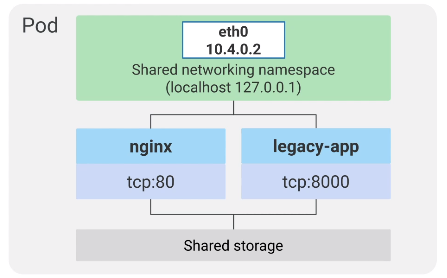

### Pod 

* Inside the Pod, containers share networking namespace. All containers appear like they are installed on the same 
machine, thus they should communicate via localhost with different port values.