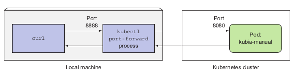

# Commands

### General

* `kubectl get pods` - list Pods 
* `kubectl get pods -o wide` - IP and Node info about the pods
* `kubectl create -f simple.yaml` - Creating a Pod based on the YAML definition
* `kubectl get po [pod-name] -o yaml ` - Show definition of running Pod
* `kubectl get po -a` - Show all pods (even Completed)
* `kubectl logs [pod-name]` - Show Pod logs (instead of ssh to node and docker logs...)
* `kubectl logs [pod-name] --previous` - Logs of previous containers runs
* `kubectl port-forward [pod-name] 8888:8080` - When you want to talk to a specific pod without going through a service 
  (for debugging or other reasons)
  
* `kubectl delete po [pod-name]` - Delete Pod
* `kubectl delete po -l rel=canary` - Delete Pods via selector
* `kubectl delete po --all` - Delete Pods in current namespace
* `kubectl edit [object] [object-name]` - Edit object's config 
* `kubectl exec [pod-name] -- curl -s http://10.111.249.153` - execute command in running container. Here curl to another Pod [Cluster-IP of the Service Pod is under].
   Double hash is needed then we want to signal the end of kubectl command options
* `kubectl exec -it [pod-name] bash` - Log in to pod's container bash.

### Labels

* `kubectl get po --show-labels` - Show pods with labels
* `kubectl get po -L creation_method,env` - Show pods with specified labels
* `kubectl label [object] [object-name] [label]` - Add label to existing Pod
* `kubectl label po kubia-manual-v2 env=debug --overwrite` - Change existing label value
* `kubectl get po -l creation_method=manual` - Query Pods: all pods with certain key and value label
* `kubectl get po -l env` - Query Pods: all pods with certain key label
* `kubectl get po -l '!env'` - Query Pods: all pods without certain key label
* `kubectl get po -l 'creation_method!=manual` - Query Pods: all pods without certain key-value label
* `kubectl get po -l 'env in (prod,devel)'` - Query Pods: all pods with certain label set either to prod or devel
* `kubectl get po -l 'env notin (prod,devel)'` - Query Pods: all pods with certain label set either to prod or devel
* `kubectl get po -l creation_method=manual,env=prod` - Query Pods: all pods matching two key-value labels (showed on Figure in Theory part)
* `kubectl label node gke-kubia-85f6-node-0rrx gpu=true` - Label the node

### Namespaces

* `kubectl get ns` - Get all Namespaces
* `kubectl create -f custom-namespace.yaml` - Create Namespace from YAML
* `kubectl create namespace custom-namespace` - Create namespace from command
* `kubectl get po --namespace kube-system` - Get all Pods in Namespace. If --ns not specified then K8 returns objects from ns set up in `current context`
* `kubectl create -f kubia-manual.yaml -n custom-namespace` - Create an object under namespace
* `alias kcd='kubectl config set-context $(kubectl config current-context) --namespace'` - Quickly switch to a different namespace, by setting up the following
  alias. Usage: `kcd some-namespace`
* `kubectl delete ns custom-namespace` - Delete namespace. Along with it will be deleted all it's resources.
* `kubectl delete all --all` - Delete all resources in current namespace. 

