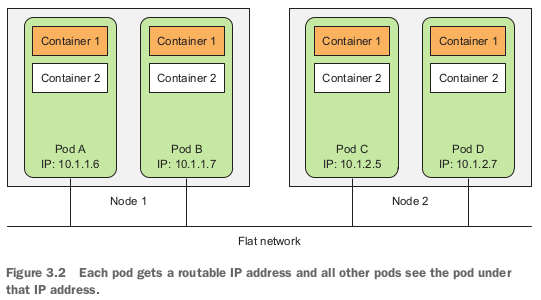
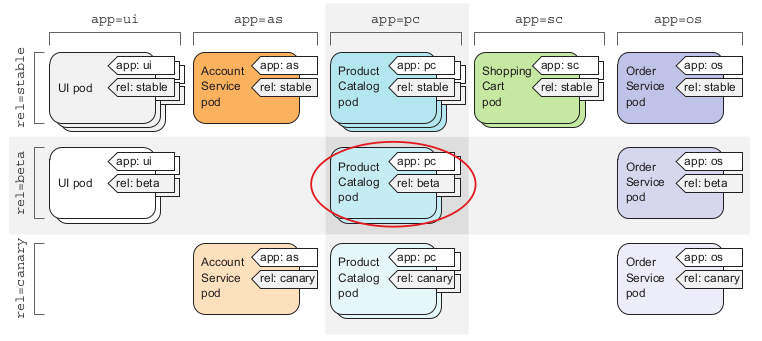

# Pods

## General

* Basic building block in K8
* Idea is to deploy docker containers on atomic K8 resource
* Pod can contain one or more containers. Pod should contain two or more only if 
  they are logically interconnected.
* Pod always run on one Node.
* Each Pod gets the exact amount of computational resources it requests (CPU, memory, and so on) and its accessibility from other pods
  isn’t at all affected by the node the pod is scheduled to (exception is when I want to run pods on specific hardware, i.e. GPU, see @Labels)
* Containers are designed to run only a single process per container. Otherwise, 
  it is your responsibility to keep all those processes running, manage their logs, 
  automatically restarting individual processes if they crash and so on.
  Therefore, you need to run each process in its own container and let the K8 do the 
  job. That’s how Docker and Kubernetes are meant to be used.
* A pod of containers allows you to run closely related processes together and provide 
  them with (almost) the same environment as if they were all running in a single
  container, while keeping them somewhat isolated.
* All containers in a Pod run under **the same** Network and UTS namespaces (they share
  the same hostname and network interfaces) and can communicate through one IPC.

* Communication between pods is always simple like in LAN (regardless of the
  actual inter-node network topology). 
* Think of pods as separate machines, but where each one hosts only a certain app.
* Scaling: if one Pod has Backend and the other one Frontend, we can scale them 
  individually with no problem at all.
* When to use multiple containers in a Pod:
    * Do they need to be run together or can they run on different hosts?
    * Do they represent a single whole or are they independent components?
    * Must they be scaled together or individually?
* Deleting Pod means terminating all the containers that are part of that pod

## Labels

* Categorizing Pods into subsets / **groups**
* Labels can be attached to any Kubernetes object (including nodes)
* Label is an arbitrary **key-value** pair you attach to a resource, which is then utilized when selecting resources using label selectors
  (resources are filtered based on whether they include the label specified in the selector)
* Resource (aka object) can have **many** (unique) labels
* You can specify labels in config file, example in `simple-with-labels.yaml`
* **Label selectors** allow you to select a subset of pods tagged with certain labels and perform an operation on those pods
* A label selector can select resources based on whether the resource
  * Contains (or doesn’t contain) a label with a certain key
  * Contains a label with a certain key and value
  * Contains a label with a certain key, but with a value not equal to the one you specify
* You could want to **run some Pods on different nodes** (for example some pod needs GPU computation).
  Instead of specifying the node, you should describe the node requirements and then let Kubernetes select a
  node that matches those requirements. This can be done through node labels and
  node label selectors.
* Good practice is to add labels to the nodes which specify the i.e. hardware [gpu=true]. 
* If we want to deploy a Pod that needs GPU, we should add this label in YAML file under `nodeSelector`. See `simple-gpu.yaml`.
* **Annotations** for objects - can hold more info than labels but cannot be used by selectors (mostly used by tools).
  * Can be used to describe each Pod
  
## Namespaces
* Labels can overlap, so often we could have overlapping groups of Pods.
  Namespaces are the solution to have non-overlapping groups.
  * **If several users or groups of users are using the same Kubernetes
    cluster, and they each manage their own distinct set of resources, they should each use
    their own namespace.** Can be also used for permissions set up.
  * We would want to keep separate names for different projects in the Organization. If several 
  * From the beginning all Pods and other objects are created in `default` namespace. There also exist i.e. `kube-system`
    namespace which holds K8 specific Pods.
* **Be careful:** **namespaces** to not guarantee resources isolation. Pods could be communicating with each other even if they are in separate namespaces.
  Whether namespaces provide network isolation depends on which networking solution is deployed with Kubernetes.

