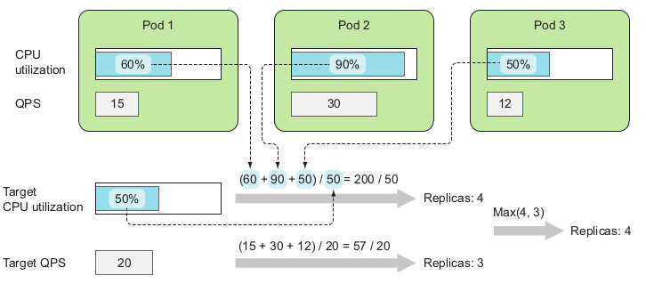
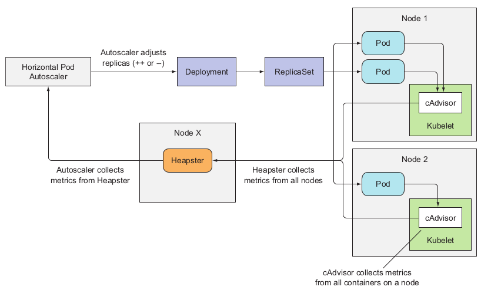
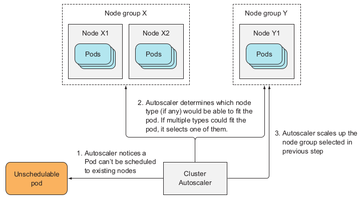
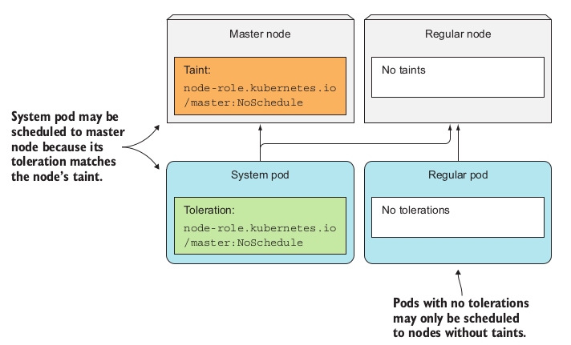

## Autoscaling

* Applications running in pods can be scaled out **manually** by increasing the
  **replicas field** in the ReplicationController, ReplicaSet, Deployment, or other
  scalable resource.
  
### Resource units in Kubernetes

* Requests vs Limits
  * Request - what the Container is guaranteed to get. K8 will only schedule the Pod on the Node which can give
  container the resource
  * Limit -  makes sure Container never goes above the value. It goes up to the value, and then it is restricted.
* 1 CPU unit is equivalent to 1 physical CPU core, or 1 virtual core, depending on whether the 
  node is a physical host or a virtual machine running inside a physical machine.
* Fractional requests are allowed. When you define a container with `spec.containers[].resources.requests.cpu` 
  set to 0.5, you are requesting half as much CPU time compared to if you asked for 1.0 CPU. 
  For CPU resource units, the quantity expression 0.1 is equivalent to the expression 100m, 
  which can be read as "one hundred millicpu". 
  Some people say "one hundred millicores", and this is understood to mean the same thing.
* **ResourceQuota** - quota for resources. Use case would be to restrict resources for "test or dev namespace" and set 
  no limit for "prod namespace" resources
* **LimitRange** -  enforces itself on individual containers, can prevent people from creating super tiny or super
  large containers inside the namespace
  
### Horizontal Pod Autoscaling

* Automatic scaling of the number of pod replicas managed by a controller. It’s performed by the Horizontal controller, which is enabled and
  configured by creating a `HorizontalPodAutoscaler` (HPA) resource.
* The controller periodically checks pod metrics, calculates the number of replicas required to meet
  the target metric value configured in the HorizontalPodAutoscaler resource, and
  adjusts the `replicas field` on the target resource (Deployment, ReplicaSet, Replication-Controller, or StatefulSet)
* The autoscaling process can be split into three steps:
    * Obtain metrics of all the pods managed by the scaled resource object.
    * Calculate the number of pods required to bring the metrics to (or close to) the
      specified target value.
    * Update the replicas field of the scaled resource.
* Pod and node **metrics are collected** by an agent called **cAdvisor**, which runs in the Kubelet on each node,
  and then aggregated by the cluster-wide component called Heapster. The horizontal
  pod autoscaler controller gets the metrics of all the pods by querying Heapster through REST calls.
* Heapster must be running in the cluster for autoscaling to work.
  
  

* The Autoscaler is concerned, only about the pod’s guaranteed CPU amount (the `CPU requests`) 
  is important when determining the CPU utilization of a pod.
  * There is possibility to watch other metrics like `Queries-Per-Second` or `latency milliseconds`
* The Autoscaler compares the pod’s actual CPU consumption and its CPU requests, which
  means the pods you’re autoscaling need to have CPU requests set (either directly or
  indirectly through a LimitRange object) for the Autoscaler to determine the CPU utilization percentage.
* Always set the target CPU usage **well below 100%** (and definitely never
  above 90%) to leave enough room for handling sudden load spikes.
* To enable horizontal autoscaling of its pods, you
  need to create a `HorizontalPodAutoscaler` (HPA) object and point it to the Deployment. You could prepare and post the YAML manifest for the HPA, but an easier way
  exists—using the kubectl autoscale command: `kubectl autoscale deployment kubia --cpu-percent=30 --min=1 --max=5`
  * 30% is the target of average CPU utilization of the workload (average across all the deployed Pods) 
* There is a limit on how soon a subsequent autoscale operation can
  occur after the previous one. Currently, a **scale-up** will occur only if no rescaling
  event occurred in the **last three minutes**. A **scale-down** event is performed even less
  frequently—**every five minutes**. Keep this in mind so you don’t wonder why the
  autoscaler refuses to perform a rescale operation even if the metrics clearly show
  that it should.

## Cluster Autoscaler

* The Cluster Autoscaler takes care of automatically provisioning additional nodes
  when it notices a pod that can’t be scheduled to existing nodes because of a lack of
  resources on those nodes. It also de-provisions nodes when they’re underutilized for
  longer periods of time.
* CA works through observing the Pod requests and based on them makes decisions. 
  * If there is **enough** resources then the pod is **scheduled**.
  * If there are **not enough** resources then a new node has to be **added**.
  * If there are **too many** resources in the cluster then some nodes should be **removed**.
* Process of scaling up when Cluster Autoscaler finds a Pod that can’t be scheduled to
  existing nodes
  
  
* Node will only be returned to the cloud provider if the Cluster Autoscaler
  knows the pods running on the node will be rescheduled to other nodes.
* When a node is selected to be shut down, the node is first marked as **unschedulable** and then all the pods 
  running on the node are **evicted**. Because all those pods belong to ReplicaSets or other controllers, their 
  replacements are created and scheduled to the remaining nodes.
* **PodDisruptionBudget** - contains only a pod label selector and a number specifying the minimum number of pods that 
  must always be available (some services require minimum number of pods always keeps running). This way when node is 
  shut down voluntarily, either by the Cluster Autoscaler or by a human operator, you can make sure the operation 
  doesn’t disrupt the service provided by the pods.

### Node pools

In most cases we are deploying more than one type of the workload, more than one size of the pods.
It's very hard to optimize resources usage (as little as possible not used resources) with just **one type of nodes**
Good practice is to use node pools - groups of identical nodes within the cluster

### Scaling node pools with NAP

* CA monitors the state of the entire cluster, but it is also simulating the action of scheduler **across all the existing
  node pools**. What would that have been if we enlarge pool 1, or 2, etc... (lots of combinatorics in the background)
* **Node auto provisioning** - CA creates new node pools. If there is a Pod to be deployed and there is no node which 
  satisfies it's requested resources - creates new node pool with matching node.
  * Enable with 
    ```
    gcloud container clusters update CLUSTER_NAME \
    --enable-autoprovisioning \
    --min-cpu MINIMUM_CPU \
    --min-memory MIMIMUM_MEMORY \
    --max-cpu MAXIMUM_CPU \
    --max-memory MAXIMUM_MEMORY \
    --autoprovisioning-scopes=https://www.googleapis.com/auth/logging.write,https://www.googleapis.com/auth/monitoring,https://www.googleapis.com/auth/devstorage.read_only
    ```
  * Acting as consultant to CA
  * NAP schedules GPU!
* You can specify the default identity (either a service account or one or more scopes) for new auto-provisioned 
  node pools using the gcloud CLI or through a configuration file.
* New node pools do not inherit identities from other node pools. If you do not specify a default identity, 
  workloads running in auto-provisioned node pools cannot access any Google Cloud APIs. For example, if you pull 
  container images from a private Artifact Registry repository, 
  you must add the https://www.googleapis.com/auth/devstorage.read_only scope.
  
## Taints and Tolerations



### Preemptible VMs

* Look `@job-preemptible-vm.yaml`. NAP will automatically create preemptible VM node pool if Pod/Job spec contains 
`nodeSelector` and `toleration` for preemptible VMs.
```
nodeSelector:
  cloud.google.com/gke-preemptible: "true"
tolerations:
  - key: cloud.google.com/gke-preemptible
    operator: Equal
    value: "true"
    effect: NoSchedule
```
### Spot VMs

* Analogous behaviour like in preemptible machine case.
* In Pods and Job use `nodeSelector` with `cloud.google.com/gke-spot: "true"` value.
* [Scheduling workloads on Spot VMs](https://cloud.google.com/kubernetes-engine/docs/concepts/spot-vms#scheduling_workloads_on_spot_vms)
* Add toleration for `cloud.google.com/gke-spot="true":NoSchedule` taint in Pod spec:
```
nodeSelector:
  cloud.google.com/gke-spot: "true"
tolerations:
  - key: cloud.google.com/gke-spot
    operator: Equal
    value: "true"
    effect: NoSchedule
```
### Best practices

* Specify correct resource requests for Pods
* Use PodDisruptionBudget to maintain the app's availability
* Consider using `optimize-utilization`: Prioritize optimizing utilization over keeping spare resources in the cluster. 
  When enabled, Cluster Autoscaler will scale down the cluster more aggressively: it can remove more nodes, and remove nodes faster. 
  (money saver, [youtube link](https://www.youtube.com/watch?v=9dRIX029d_U))

## Resources

* https://gcpinstances.doit-intl.com/ - GCP instances from cheapest 
* https://www.youtube.com/watch?v=fLOkcXcxKE4
* https://github.com/kubernetes/autoscaler/blob/master/cluster-autoscaler/proposals/node_autoprovisioning.md
* https://github.com/kubernetes/autoscaler/blob/master/cluster-autoscaler/FAQ.md
* Configure system pods - https://justin.palpant.us/tuning-cluster-autoscaler-on-gke/