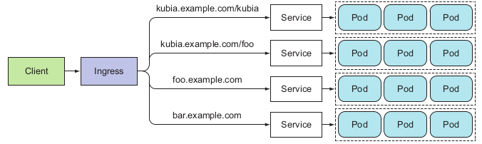

# Services

* Service - **constant point of entry to a group of pods providing the same service**.
* Each service has an IP address and port that never change while the service exists.
* Clients can open connections to that IP and port, and those connections are then routed to one of the pods backing
  that service.
* Pods need a way of finding other pods if they want to consume the services they provide.
* Why Services:
  * Pods are ephemeral — They may come and go at any time, whether it’s because a
  pod is removed from a node to make room for other pods, because someone
  scaled down the number of pods, or because a cluster node has failed.
  * Kubernetes assigns an IP address to a pod after the pod has been scheduled to a node
  and before it’s started — Clients thus can’t know the IP address of the server pod
  up front.
  * Horizontal scaling means multiple pods may provide the same service — Each of those
  pods has its own IP address. Clients shouldn’t care how many pods are backing
  the service and what their IPs are. They shouldn’t have to keep a list of all the
  individual IPs of pods. Instead, all those pods should be accessible through a
  single IP address.
* Use case - frontend and backend:

## External connections

* External clients need to connect to the frontend pods without caring if there’s
  only a single web server or hundreds. The frontend pods need to connect to the backend database. Because the data-
  base runs inside a pod, it may be moved around the cluster over time, causing its IP address to change.
  * By creating a service for the frontend pods and configuring it to be accessible from
    outside the cluster, you expose a single, constant IP address through which external
    clients can connect to the pods.
  * By creating a service for the backend pod, you create a stable address for the backend pod. The service address doesn’t
    change even if the pod’s IP address changes.
  * Additionally, by creating the service, you also enable the frontend pods to easily find the backend service by its name through
    either environment variables or DNS.
* Service knows which Pods it is load balancing via **label selector**.
* **Cluster-IP** - only accessible from inside the cluster. This IP can be used to allow group of Pods to talk with another group of Pods.
* Service act as load balancer. That means it 'randomly chooses' which Pod under the Service will be taken to serve the request.
  * I you want all requests to be redirected to the same Pod every time use `sessionAffinity=[pod-cluster-ip]` property in Service config.
* **Discovering Services**: instead of manually looking up services IP's, use environment variables or DNS.
  * Environment variables:
    * When a pod is started, Kubernetes initializes a set of environment variables pointing
      to each service that exists at that moment.
    * You can expose the backend Pod through a service called `backend-database` and then
      have the frontend pod look up its IP address and port through the environment vari-
      ables `BACKEND_DATABASE_SERVICE_HOST` and `BACKEND_DATABASE_SERVICE_PORT`
  * DNS:
    * Each service gets a DNS entry in the internal DNS server, and client pods that know
      the name of the service can access it through its fully qualified domain name (FQDN)
      instead of resorting to environment variables.
    * Example: frontend Pod can connect to the backend by opening a connection to the following FQDN: backend-database.default.svc.cluster.local
      which corresponds to: [service-name].[namespace].svc.cluster.local, where svc.cluster.local is a configurable cluster
      domain suffix used in all cluster local service names. The client must still know the service's port number (could be get from env. var.).
      You can even use only [service-name] if Pod is in the same namespace.
  * **Debugging**: do not ping Service on it's ClusterIP. It is a Virtual IP which only works when combined
    with the service's port.

* An **Endpoints** resource is a list of IP addresses and ports exposing a service.
  Although the pod selector is defined in the service spec, it’s not used directly when
  redirecting incoming connections. Instead, the selector is used to build a list of IPs
  and ports, which is then stored in the Endpoints resource. When a client connects to a
  service, the service proxy selects one of those IP and port pairs and redirects the
  incoming connection to the server listening at that location.
* If you want to create the Service, which will forward connections to **external service**, you need
  to manually create a Service **without selector** (so SVC won't create any Endpoint, because it will not
  know which Pods to incorporate!) and then create Endpoints resource manually (@see external-service.yaml and external-service-endpoints.yaml)
  * You can also use FQDN (without creating Endpoints object) by using `type: ExternalName`. Service then will be available at
  [service-name]. Then we can change the API provider easily, still having the same Service IP!
    
* **External clients of a Service**, few ways:
  * **NodePort** - for that service, each cluster node opens a port on the node itself (hence the name) and redirects traffic received
    on that port to the underlying service. Then service is accessible in two ways: at the ClusterIP and dedicated port on **all** nodes. (@see kubia-svc-nodeport.yaml)
    * Service will be accessed via [ClusterIP:port] and [NodeIP:nodePort] (for each node). 
    * Remember to allow traffic to nodes from external sources on Firewall (@see commands) 
  * **LoadBalancer (extension of NodePort)** - makes the service accessible through a dedicated load balancer, provisioned
    from the cloud infrastructure Kubernetes is running on. 
    * The load balancer redirects traffic to the node port across all the nodes. Clients connect to the service
    through the load balancer’s IP.
    * No firewall magic.
  * **Ingress** - operates on HTTP level. 
* When an external client connects to a service through the node port (or LB), the randomly chosen
  pod may or may not be running on the same node that received the connection. Then, an
  additional network hop is required to reach the pod. `externalTrafficPolicy: Local`  - redirects external
  traffic only to pods running on the node that received the connection.
  * Be aware: if no Pod is on the Node available - request hangs. It also disrupts load balancing
 

### Ingress

* Ingress (noun) — The act of going in or entering; the right to enter; a means or place of entering; entryway.
* One important reason is that each LoadBalancer service requires its own load balancer with its own public IP address, whereas an Ingress only requires one, even when
  providing access to dozens of services. When a client sends an HTTP request to the
  Ingress, the host and path in the request determine which service the request is forwarded to.
* Ingress needs NodePort as a destination service.
* After creating Ingress, we can hit the Pods behind the domain. Last step for doing it is to either configure your DNS servers to resolve
  `kubia.example.com` to that IP, or you can add the following line to `/etc/hosts`:
  * [IngressIP] kubia.example.com
* Ingress can handle multiple hosts and endpoints and send requests to different services.

  
* Ingress supports **TLS** (Kubernetes in Action, 5.4.4)

### Readiness

* When a pod is ready to accept connections? Pod can have a long start-up time. We do not want for it to accept requests immediately.
* **Readiness probe** - is invoked periodically and determines whether the specific
  pod should receive client requests or not. Types of probes:
  * An Exec probe, where a process is executed. The container’s status is determined by the process’ exit status code.
  * An HTTP GET probe, which sends an HTTP GET request to the container and, the HTTP status code of the response determines whether the container is
  ready or not.
  * A TCP Socket probe, which opens a TCP connection to a specified port of the container. If the connection is established, the container is considered ready.
* When a container is started, Kubernetes can be configured to wait for a configurable
  amount of time to pass before performing the first readiness check. After that, it
  invokes the probe periodically and acts based on the result of the readiness probe. If a
  pod reports that it’s not ready, it’s removed from the service. If the pod then becomes
  ready again, it’s re-added.
* If a pod’s readiness probe fails, the pod is removed from the **Endpoints** object.
* Let's define readiness probe in the **ReplicationController** (@see `kubia-rc-readiness-probe.yaml`)
  If we were to edit existing RC, we need to delete old ones and let RC to create new ones (with probe). 
  Until each Pod will have existing file in `./ready`, until Pods will not be in **Ready** state!
* In the real world, the readiness probe should return success or failure depending on whether the app can (and wants to) receive client requests or not.  
* If you want to add or remove a pod from a service manually, add `enabled=true` as a label to your pod and to the label selector of your service.
  Remove the label when you want to remove the pod from the service.
* **Always define a readiness probe**
* **Don't include Pod shutdown logic into your readiness probes**

### Headless Service

* What if the client needs to connect to all of those pods? What if the backing pods themselves need to
  each connect to all the other backing pods? 
  * For a client to connect to all pods, it needs to figure out the IP of each individual pod.
  * When you look up for the Service IP, you look up a DNS([service-name]) -> ServiceIP.
  * **Solution:** setting the **ClusterIP** field in a service spec to **None** makes the service headless, as
    Kubernetes won’t assign it a cluster IP through which clients could connect to the
    pods backing it (@see `kubia-svc-headless.yaml`).
* To perform DNS lookup from inside the Pod (to find Pods IP's)
  * `tutum/dnsutils container` image, which is available on Docker Hub and contains both the `nslookup` and the `dig`
    binaries
  * `kubectl exec dnsutils nslookup kubia-headless` - perform DNS lookup (inside `dnsutils` Pod). All the returned IP's are the IP's of ALL Pods
    (if `ClusterIP!=None` DNS lookup will return Service ClusterIP)
    

# Troubleshooting

* First, make sure you’re connecting to the service’s cluster IP from within the cluster, not from the outside.
* Don’t bother pinging the service IP to figure out if the service is accessible (remember, the service’s cluster IP is a virtual IP and pinging it will never work).
* If you’ve defined a readiness probe, make sure it’s succeeding; otherwise the pod won’t be part of the service.
* To confirm that a pod is part of the service, examine the corresponding Endpoints object with `kubectl get endpoints`.
* If you’re trying to access the service through its FQDN or a part of it (for exam-
ple, `myservice.mynamespace.svc.cluster.local` or `myservice.mynamespace`) and it doesn’t work, 
see if you can access it using its cluster IP instead of the FQDN.
* Check whether you’re connecting to the port exposed by the service and not the target port.
* Try connecting to the pod IP directly to confirm your pod is accepting connections on the correct port.
* If you can’t even access your app through the pod’s IP, make sure your app isn’t only binding to localhost.
