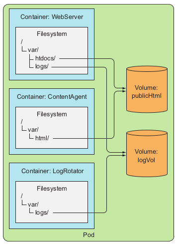
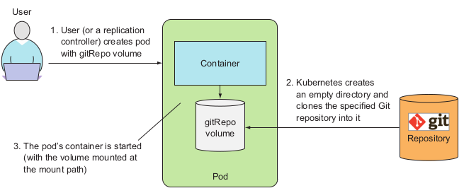

# Volumes

* Volumes are defined as a part (component) of a Pod, are defined in Pod specification and thus
  share the same lifecycle as a Pod.
* Volume is created when the pod is **started** and is destroyed when
  the pod is **deleted** (not **restarted!**).
* If a pod contains multiple containers, the volume can be used by all of them at once.
* A volume is available to all containers in the
  pod, but it must be mounted in each container that needs to access it. In each con-
  tainer, you can mount the volume in any location of its filesystem.
* A volume is bound to the lifecycle of a pod and will stay in existence only while the
  pod exists, but depending on the **volume type**, the volume’s files may remain intact
  even after the pod and volume disappear, and can later be mounted into a new vol-
  ume. Let’s see what types of volumes exist.
  * `emptyDir` — A simple empty directory used for storing transient data.
  * `hostPath` — Used for mounting directories from the worker node’s filesystem
  into the pod.
  * `gitRepo` — A volume initialized by checking out the contents of a Git repository.
  * `nfs` — An NFS share mounted into the pod.
  * `gcePersistentDisk (Google Compute Engine Persistent Disk), awsElastic-
  BlockStore (Amazon Web Services Elastic Block Store Volume), azureDisk
  (Microsoft Azure Disk Volume)`— Used for mounting cloud provider-specific
  storage.
  * `cinder , cephfs , iscsi , flocker , glusterfs , quobyte , rbd , flexVolume , vsphere-
    Volume , photonPersistentDisk , scaleIO` — Used for mounting other types of
    network storage.
  * `configMap , secret , downwardAPI` — Special types of volumes used to expose cer-
    tain Kubernetes resources and cluster information to the pod.
  * `persistentVolumeClaim` — A way to use a pre- or dynamically provisioned persistent storage. 
    (We’ll talk about them in the last section of this chapter.)
    
### emptyDir

* The volume starts out as an empty directory, the volume’s contents are lost when the pod is deleted.
* Useful for sharing files between containers running in the same pod, or when one container is performing a sort
  operation on a large dataset, which can’t fit into the available memory.
* See `empty-dir-pod.yaml`.
* You can specify the emptyDir medium. By default, it uses worker node disks, but it can use node **memory**.
  * `medium: Memory` - create volume in tmpfs filesystem

### gitRepo

* **Note: If you want to clone a private Git repo into your container, you should use a git-
  sync sidecar or a similar method instead of a gitRepo volume.**
* An emptyDir volume that gets populated by cloning a
  Git repository and checking out a specific revision when the pod is starting up (but
  before its containers are created)
* After the gitRepo volume is created, it **isn’t kept in sync** with the repo
  it’s referencing. The files in the volume will not be updated when you push
  additional commits to the Git repository. However, if your pod is **managed by
  a ReplicationController**, deleting the pod will result in a new pod being cre-
  ated and this new pod’s volume will then contain the latest commits.
* See `git-repo-pod.yaml`.
* Instead of having to delete the pod every time you make changes, you could
  run an additional process, which keeps your volume in sync with the Git repository.
  * Create **sidecar container** - a container that augments the operation of the main container of the pod.
    Then, you can use an existing container image instead of cramming additional logic into the
    main app’s code, which would make it overly complex and less reusable.
  * This **sidecar container** should keep a volume synchronized
    with a Git repository. There are many images that do that (search for 'git sync')
    
### hostPath

* Most pods should be oblivious of their host node, so they shouldn’t access any files on
  the node’s filesystem. But certain system-level pods (remember, these will usually be
  managed by a DaemonSet) do need to either read the node’s files or use the node’s
  filesystem to access the node’s devices through the filesystem.
* Type of **persistent storage**.
* Be careful: Pods are often scheduled to different Nodes! Data saved on one Node will not be 
  available on the other.
* Use cases: 
  * system Pods running in `kube-system` namespace.
  * trying out persistent storage in single-node clusters, such as the one created by Minikube.
  
### Persistent Storage aka gcePersistentDisk

* Data needs to be accessible from any cluster node, it must be stored on some type of network-attached stor-
  age (NAS).