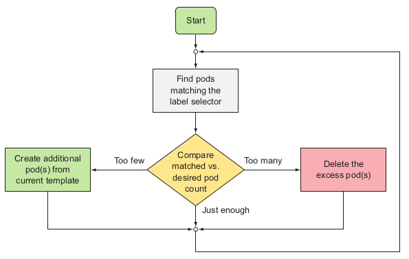
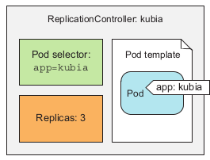
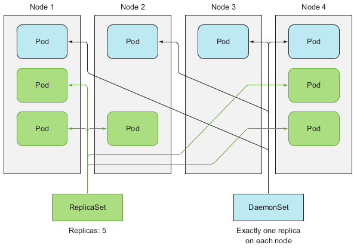

# Controllers

* For Pods than need to run continuously.
* We could manage Pods manually. In real-world we want our deployments to stay up and running automatically and
  remain healthy without any manual intervention.
* Replication-Controllers or Deployments create and manage the actual pods.
* As soon as a pod is scheduled to a node, the Kubelet on that node 
  will run its containers and, from then on, keep them running as long as the pod exists. If the container’s 
  main process crashes, the Kubelet will restart the container.
* Sometimes apps stop working without their process crashing. For example, app start throwing OutOfMemoryErrors, but the JVM
  process keeps running. It would be great to have a way for an app to signal to
  Kubernetes that it’s no longer functioning properly and have Kubernetes restart it.
* **Liveness probes** - K8 will periodically execute the probe and restart the container if the probe fails. K8 can probe via:
  * The HTTP request on the container's IP, port and path you specify. If response code is not an error - the probe is considered successful. (see @kubia-liveness-probe.yaml)
    * Error of last Pod failure can be found in `kubectl describe po [pod-name]`. If Exit code == 137 then process was killed by an external
      signal like SIGKILL. This can indicate that Pod was not yet started properly (initialDelaySeconds)
    * Good practice is to create dedicated `/health` endpoint (without auth!) which will internally check app state.
    * Be sure to check only the internals of the app and nothing influenced by an external
      factor.
  * A TCP Socket probe tries to open a TCP connection to the specified port of the container.
  * An Exec probe executes an arbitrary command inside the container and checks the command’s exit status code.
* If the **node crashes**, then Control Plane should create replacements for all the Pods that went down with the node.
  For that we need the Pods to be managed by **Controller**.
* To **change** the controller, delete it without deleting the Pods (`--cascade=false`) and create new controller with proper selector. 
  Existing Pods with matching labels will be then managed by new controller.

## ReplicationController

* A ReplicationController is a Kubernetes resource that ensures its pods are always kept running.
* A ReplicationController constantly monitors the list of running pods and makes sure
  the actual number of pods of a “type” (that is pods that match a certain label selector) always matches the desired number. If too few
  such pods are running, it creates new replicas from a pod template. If too many such
  pods are running, it removes the excess replicas.
* When a cluster node fails, RC creates replacement replicas for all the pods that
  were running on the failed node
* RC enables easy horizontal scaling of pods—both manual and automatic
* A ReplicationController has three essential parts: 
  * `label selector` - determines which pods are in the RC scope
  * `replica count` - specifies the desired number of pods that should be running
  * `pod template` - used when creating new pod replicas
  

* When Pod is deleted, RC sees that this internal list of Pods is not matching the desired state.
  Then he is creating new Pod. When Node is down, RC spins new Pods on another one. When we will add new
  label to the Pod under RC control in a way that it no longer matches the RC selector - new Pod will be created.
* Changing Pod template in RC config will need deleting old Pods. 
* Scaling of Pods comes with changing "desired replicas count" in RC config.

## ReplicaSets
* Almost identical as Replication Controller, newer version.
* Usually not created directly but implicitly together with Deployment.
* ReplicaSet’s selector also allows matching pods that lack a certain label or pods that include a certain label key, regardless of its value
* RS's `matchExpressions` must contain key, operator and values fields: 
  * `key`: app
  * `operator`: `In`, `NotIn`, `Exists`, `DoesNotExist`
  * `values`: [array]
* Multiple expressions evaluate to 'AND':
  * matchExpressions:
    - {key: tier, operator: In, values: [cache]}
    - {key: environment, operator: NotIn, values: [dev]}

## Daemon Sets
* Useful in situation, where you want a pod to run on each and every node in the cluster (and each node needs to run
  exactly one instance of the pod.
  

* A DS deploys pods to all nodes in the cluster, unless you specify that the pods should only run on a subset of all the nodes.
  * done via `nodeSelector` which behaves analogically to `selector` in RC but on nodes (@see ssd-monitor-daemon-set.yaml)
* DaemonSets are meant to run system services, which usually need to run even on 'unschedulable' nodes. Other use cases:
  * running a cluster storage daemon on every node
  * running a logs collection daemon on every node
  * running a node monitoring daemon on every node

# Jobs

* For Pods than need to run single completable task.

## Job
* Allows you to run a pod whose container isn’t restarted when the process running inside finishes successfully. Once it
  does, the pod is considered complete.
* In the event of a node failure, the pods on that node that are managed by a Job will
  be rescheduled to other nodes the way ReplicaSet pods are.
* You could run the task in an unmanaged pod and wait for it to finish, but in the event of a node failing, or the pod being evicted from the node while it is
  performing its task, you’d need to manually recreate it.
* Example: you had data stored somewhere, and you needed to transform and export it somewhere. (@see exporter.yaml)
* After Job completes, Pod will **not** be deleted (this happens when you delete it, or the Job that created it).
* Jobs may be configured to create more than one pod instance and run them in parallel or sequentially. 
  This is done by setting the `completions` and the `parallelism` properties in the Job spec.

